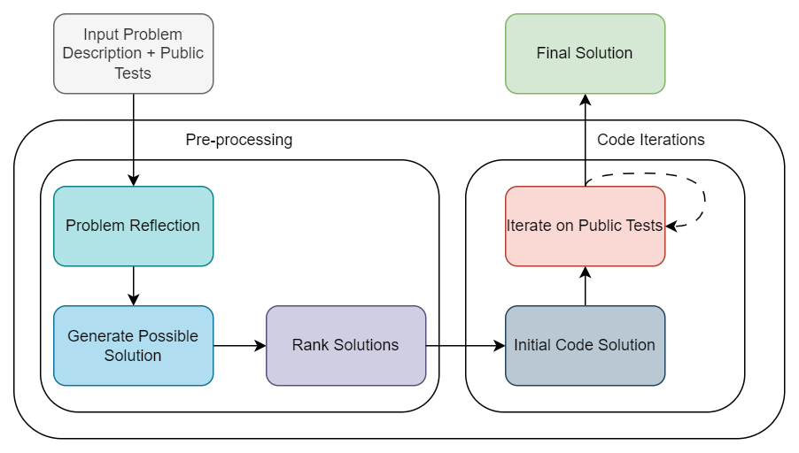

# AlphaCodium

### Code Generation with AlphaCodium: From Prompt Engineering to Flow Engineering

<!-- https://hits.seeyoufarm.com/ -->
[](https://github.com/hamidriasat/)

**Star ⭐ this repository if you find it useful!**

> This repository contains the first implementation of **[AlphaCodium](https://arxiv.org/abs/2401.08500)** in
> the [LangChain](https://www.langchain.com/) framework.

AlphaCodium is an advanced code generation tool that enhances the performance of Large Language Models (LLMs) on complex
coding tasks. It introduces a multi-stage, iterative process specifically tailored for code generation, which has shown
significant improvements in accuracy. For instance, **AlphaCodium increased GPT-4's accuracy from 19% to 44% on the
pass@5 metric**, outperforming existing methods like DeepMind's AlphaCode.

Currently, the AI test case generation and iterative AI test case generation implementations are pending and will be
completed soon. The rest of the paper's proposed workflow has been implemented using the original prompts provided in
the paper.

### Current Implementation Architecture



### How to Use the Code

1. Clone the repository:
    ```bash
    git clone https://github.com/hamidriasat/AlphaCodium.git
    cd AlphaCodium
    ```

2. Install the required dependencies:
    ```bash
    pip install -r requirements.txt
    ```

3. Place your OpenAI API key in the [.env](.env) file.

4. Execute the [alphacodium_ai_code_assistant.ipynb](alphacodium_ai_code_assistant.ipynb) file to test AlphaCodium.

> **Note:** The [RetryOutputParser](https://python.langchain.com/v0.1/docs/modules/model_io/output_parsers/types/retry/)
> is not implemented yet. Errors may occur when the LLM fails to generate the required complex output structure, resulting
> in [OutputParser](https://python.langchain.com/v0.1/docs/modules/model_io/output_parsers/) errors. In such cases, rerun
> the cell until the LLM produces the output in the correct format.

### TODO List

- [ ] Complete README.md
- [ ] Restructure overall code
- [ ] Add retry output parser
- [ ] Add AI test generation + Iterative AI test execution steps

### Feedback and Contributions

We appreciate any feedback so reporting problems, and asking questions are welcomed here.

---

This implementation is a work in progress and not an official version of AlphaCodium. It aims to explore the integration
of AlphaCodium within the LangChain framework, leveraging its robust architecture to enhance code generation
capabilities.
